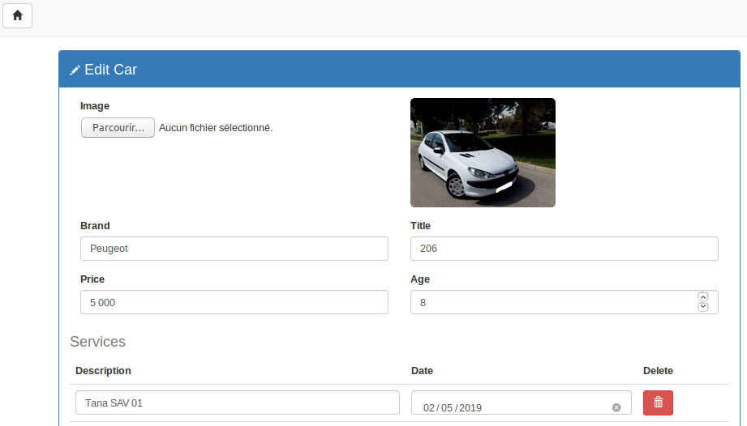
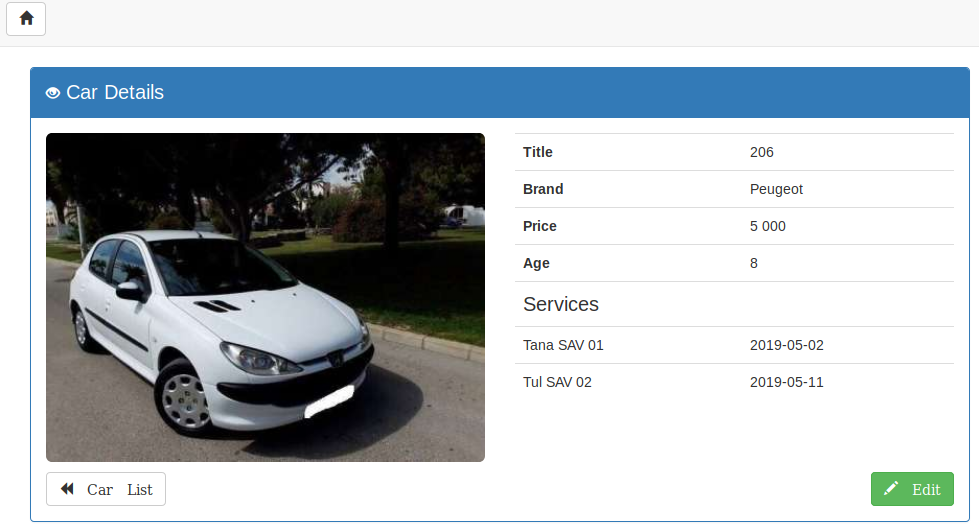

Mern-example
=========

FullStack JS app example using MERN (Mongo Express React Node).

Screenshots
---




How to install
---

This app is based on [Node.js](http://nodejs.org/).
[MongoDB](https://www.mongodb.com/) is used as database, so make sure that it is installed and running on your system.
- For backend part, it uses: [Express](https://expressjs.com/) and [Mongoose](https://mongoosejs.com/).
- And for front end, it uses: [React](https://reactjs.org/), [Redux](https://redux.js.org/), [Axios](https://github.com/axios/axios) and [Redux-thunk](https://github.com/reduxjs/redux-thunk), [React-notification-system](https://www.npmjs.com/package/react-notification-system), and [Bootstrap](https://getbootstrap.com/) v3.4.1.

Clone or Download this repository.
```
git clone https://github.com/arasT/mern-example
```
Extract the archive file and move into it.
```
cd Mern-example
```
First of all, make sure that **mongod** service is running.
```
sudo service mongod start
```
Then, run the **backend** server.
Install all needed packages (go into the *"back"* folder), then run it:

```
cd ./back
npm install
npm start
```
Finaly, run the **frontend** server.
Install all needed packages for (folder from another terminal, go into the *"front"*), then run it:
```
cd ./front
npm install
npm start
```
It will open a browser and display the home page at: http://localhost:3000.

Miscellanous
----
* Backend server use port 3001 by default, you can change it into *./back/src/config/index.js* file.
* Frontend server use port 3000 by default, you can change it into *./front/src/config/index.js* file.
* Other usefull tools: [Postman](https://www.getpostman.com/), [Mongo-express](https://www.npmjs.com/package/mongo-express).

License
----

The MIT License.
Further details see LICENSE file.

Contributing
----

Please fork if you want to contribut to this project.
